# Dockerized-GildedRose-Azure

Una vez tenemos una máquina a nuestro gusto creada procedemos a asignarle un DNS antes de conectarnos a ella. 

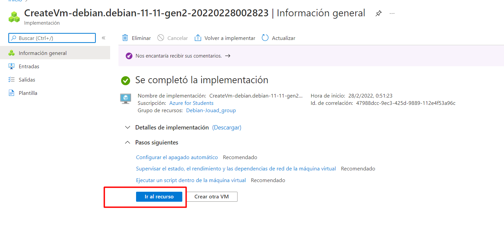
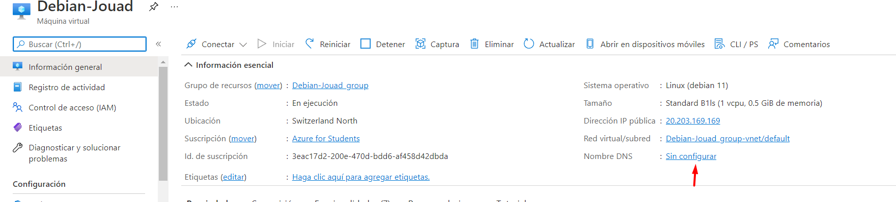
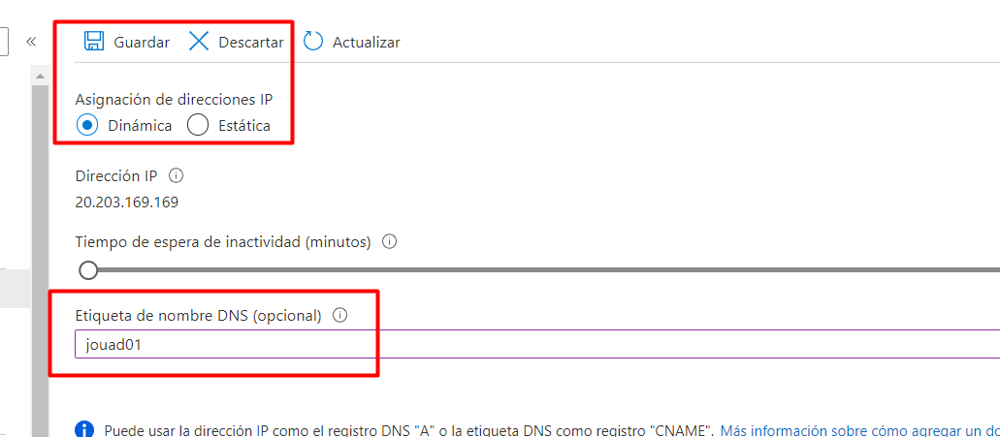

---

## Conexión SSH
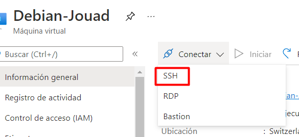

Copiamos de esa forma, nos pedirá la contraseña que previamente le hemos dado.

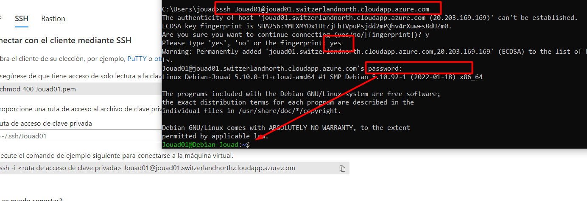

---

## Instalación paquetería, git y docker

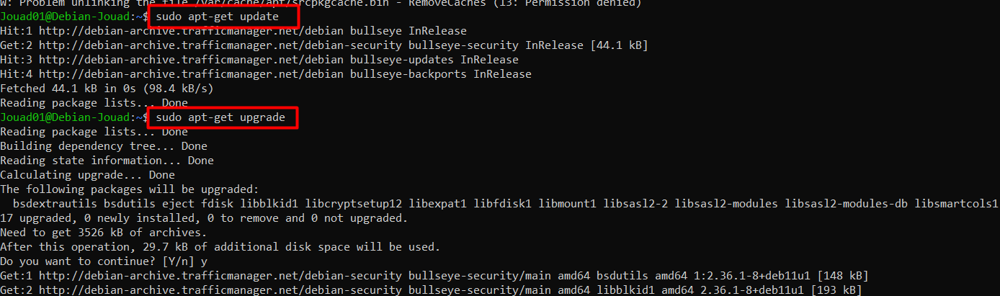
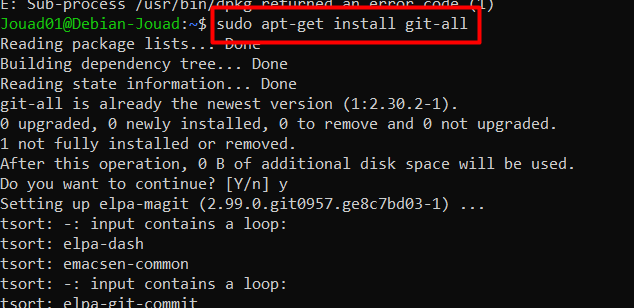
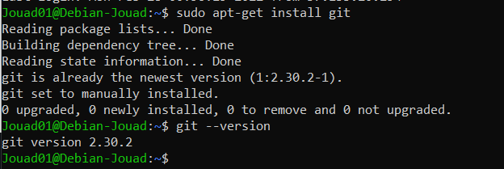

Para instalar docker desde el script de bash:

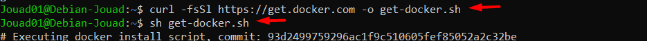

Y comprobamos la version:

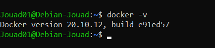

---

## GildedRose dockerizado

Copiamos el repositorio en cuestión, nos situamos en el mismo directorio y ejecutamos el comando 'docker build -t gildedrose .'
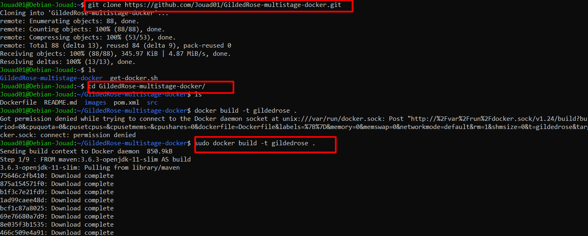

Nos da el visto bueno y comprobamos que se ejecuta correctamente imprimiendo el ejercicio.
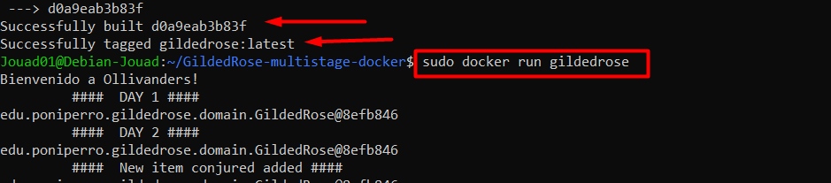
